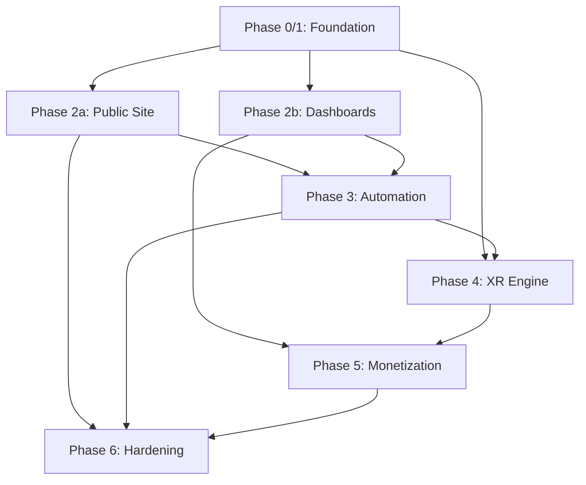

# VizTR Platform — Complete Project Audit Report

**Audit Date:** August 5, 2026  
**Auditor Role:** Senior Technical Project Auditor, Lead Software Architect, Full-Stack Engineer, SaaS Product Strategist, UI/UX Auditor, CMS Architect, SEO Auditor, Security Auditor, Release Readiness Assessor  
**Scope:** All files in `c:\Users\Arch_Viz\Desktop\VizTR\BrainStorming\opencode\`  
**Type:** Non-destructive — audit, evaluate, and recommend. No rewrite.

---

## Executive Summary

The VizTR project is an **exceptionally well-planned** SaaS + service-based platform with 2,794+ lines of feature specification, 6 phased implementation plans totaling ~245KB of detailed task-by-task blueprints, a formal Technical Decision Log, and a TechStack Selection document. The planning quality is **far above average** — each phase uses strict TDD methodology, defines file-level interfaces, includes test code, and follows conventional commits.

However, the project is currently **100% planning and 0% implementation**. There is no `package.json`, no `tsconfig.json`, no running code, no database schema file, no CI pipeline, and no deployed artifact. The gap between planning ambition and implementation reality is the single biggest risk.

> [!IMPORTANT]
> **Overall Readiness Score: 3/10 for launch, 9/10 for planning quality.**
> The plans are production-grade; the codebase does not yet exist.

---

## 1. Completeness Audit

### 1.1 Document Coverage Matrix

| Document | Lines | Purpose | Completeness |
|----------|-------|---------|-------------|
| [VIZTR-COMPLETE-FEATURES.md](file:///c:/Users/Arch_Viz/Desktop/VizTR/BrainStorming/opencode/VIZTR-COMPLETE-FEATURES.md) | 2,794 | Master feature spec (28 sections) | ✅ Excellent — v1.7.0 |
| [VIZTR-TECHSTACK-SELECTION.md](file:///c:/Users/Arch_Viz/Desktop/VizTR/BrainStorming/opencode/implementation-plans/VIZTR-TECHSTACK-SELECTION.md) | 790 | Technology selection + rationale | ✅ Complete |
| [VIZTR-TECHNICAL-DECISION-LOG.md](file:///c:/Users/Arch_Viz/Desktop/VizTR/BrainStorming/opencode/implementation-plans/VIZTR-TECHNICAL-DECISION-LOG.md) | 666 | ADR log (10 decisions) | ✅ Complete |
| [VIZTR-IMPLEMENTATION-STARTER.md](file:///c:/Users/Arch_Viz/Desktop/VizTR/BrainStorming/opencode/implementation-plans/VIZTR-IMPLEMENTATION-STARTER.md) | ~400 | Practical setup guide | ✅ Complete |
| [Phase 0/1 Foundation](file:///c:/Users/Arch_Viz/Desktop/VizTR/BrainStorming/opencode/implementation-plans/2026-08-05-phase0-1-foundation.md) | ~900 | Monorepo + DB + Auth + RLS | ✅ Complete |
| [Phase 2 Core Platform](file:///c:/Users/Arch_Viz/Desktop/VizTR/BrainStorming/opencode/implementation-plans/2026-08-05-phase2-core-platform.md) | 1,738 | Marketing + Dashboard + Admin + Portal | ✅ Complete (19 tasks) |
| [Phase 3 Automation](file:///c:/Users/Arch_Viz/Desktop/VizTR/BrainStorming/opencode/implementation-plans/2026-08-05-phase3-automation.md) | 534 | Queues + Agents + CI/CD | ✅ Complete (8 tasks) |
| [Phase 4 XR Engine](file:///c:/Users/Arch_Viz/Desktop/VizTR/BrainStorming/opencode/implementation-plans/2026-08-05-phase4-xr-engine.md) | 1,036 | 3D/XR/Streaming/Editor/Live | ✅ Complete (15 tasks) |
| [Phase 4 Marzipano](file:///c:/Users/Arch_Viz/Desktop/VizTR/BrainStorming/opencode/implementation-plans/2026-08-05-phase4-virtual-tour-marzipano.md) | 540 | 360° Virtual Tour (44 features) | ✅ Complete (15 tasks) |
| [Phase 5 Monetization](file:///c:/Users/Arch_Viz/Desktop/VizTR/BrainStorming/opencode/implementation-plans/2026-08-05-phase5-monetization.md) | 585 | Billing + Analytics + Marketplace | ✅ Complete (9 tasks) |
| [Phase 6 Hardening](file:///c:/Users/Arch_Viz/Desktop/VizTR/BrainStorming/opencode/implementation-plans/2026-08-05-phase6-hardening-launch.md) | 435 | Security + SEO + Perf + Deploy | ✅ Complete (7 tasks) |
| [Marzipano Design Spec](file:///c:/Users/Arch_Viz/Desktop/VizTR/BrainStorming/opencode/docs/superpowers/specs/2026-08-05-virtual-tour-marzipano-design.md) | 233 | Marzipano integration design | ✅ Complete |
| [Marzipano Integration Plan](file:///c:/Users/Arch_Viz/Desktop/VizTR/BrainStorming/opencode/docs/superpowers/plans/2026-08-05-virtual-tour-marzipano.md) | 660 | Doc update plan (8 tasks) | ✅ Complete |

### 1.2 Missing Documents

| Missing Document | Priority | Impact |
|-----------------|----------|--------|
| `prisma/schema.prisma` (actual DB schema file) | 🔴 Critical | Cannot migrate or seed without it |
| `package.json` / `pnpm-workspace.yaml` | 🔴 Critical | No monorepo exists to build |
| `.env.example` | 🟡 High | Devs can't onboard |
| `CONTRIBUTING.md` | 🟡 High | Team onboarding blocked |
| `README.md` (root) | 🟡 High | No project entry point |
| E2E test plan document | 🟠 Medium | Plans reference Playwright but no test strategy doc |
| API contract / OpenAPI spec | 🟠 Medium | 115+ endpoints referenced but no spec file |

---

## 2. Architecture & Tech Stack Audit

### 2.1 Architecture Assessment

**Verdict: ✅ Well-designed with minor concerns**

The architecture follows sound principles:
- **Monorepo** (pnpm + Turborepo) — ✅ Industry standard for this scale
- **Next.js 15+ App Router** — ✅ Correct for SSR/SSG + interactive dashboards
- **Supabase** (PostgreSQL + Auth + RLS + Storage) — ✅ Appropriate for zero-budget MVP
- **Decoupled XR engine** (`xr.viztr.com`) — ✅ Smart separation of heavy 3D bundles
- **BullMQ + Redis** job backbone — ✅ Proven for async processing

### 2.2 Tech Stack Risks

| Risk | Severity | Details |
|------|----------|---------|
| **Supabase vendor lock-in** | 🟡 High | Auth, Storage, RLS, Edge Functions all on Supabase. Migration path to raw Postgres + custom auth is undocumented. |
| **AgentGPT dependency** | 🟡 High | Phase 3 names AgentGPT for "12 worker agents" — AgentGPT is experimental/unstable. Consider AutoGen, CrewAI, or custom LangGraph agents instead. |
| **LangGraph JS maturity** | 🟠 Medium | LangGraph JS is newer than Python counterpart. Production stability at 13-agent scale is unproven. |
| **Marzipano maintenance** | 🟠 Medium | Marzipano hasn't had a major release since 2021. Evaluate whether the project is actively maintained before deep integration. |
| **MindAR (WebAR)** | 🟠 Medium | `mindar-image-three` is Three.js-based. Phase 4 Task 13 references it but the core engine is Babylon.js. Integration path unclear. |
| **Redis single-point-of-failure** | 🟡 High | Phase 6 mentions Sentinel/Cluster but this must be enforced from day one in prod. |

### 2.3 Tech Stack Replacements Needed

| Current | Replace With | Reason | Priority |
|---------|-------------|--------|----------|
| AgentGPT (self-hosted) | LangGraph sub-graphs OR CrewAI | AgentGPT is experimental; LangGraph can handle both CEO + worker agents | 🔴 Critical |
| `mindar-image-three` | `@nicolo-ribaudo/webar-js` or Babylon.js native WebXR AR | Three.js dependency conflicts with Babylon.js-only policy | 🟠 Medium |
| Marzipano (if unmaintained) | Photo Sphere Viewer (actively maintained) | Risk mitigation | 🟠 Medium (evaluate first) |

---

## 3. Gap Analysis

### 3.1 Critical Gaps

| # | Gap | Phase | Impact | Recommendation |
|---|-----|-------|--------|----------------|
| 1 | **No actual codebase exists** | All | 🔴 Showstopper | Begin Phase 0/1 immediately — scaffolding is the bottleneck |
| 2 | **No Prisma schema file** | 0/1 | 🔴 Critical | Plans reference 30+ models but no `.prisma` file exists |
| 3 | **No CI/CD pipeline** | All | 🔴 Critical | `.github/workflows/` is planned in Phase 6 but should be Phase 0 |
| 4 | **No error boundary / global error handling strategy** | 2 | 🟡 High | No mention of React Error Boundaries or Next.js `error.tsx` patterns |
| 5 | **No i18n / RTL strategy implementation** | 6 | 🟡 High | Feature doc §19 mentions it, no phase plan addresses it |
| 6 | **No rate limiting implementation** | 2 | 🟡 High | Plans reference `rateLimit` utility but it's never defined in any task |
| 7 | **No WebSocket / real-time for client portal messages** | 2 | 🟠 Medium | `sendMessage` in Task 15 is HTTP-only; no Supabase Realtime subscription |
| 8 | **No file/image optimization pipeline** | 3 | 🟠 Medium | `next/image` referenced but no Sharp/image-optimization config |
| 9 | **No cookie consent banner** | 6 | 🟡 High | Phase 6 Checkpoint mentions it but no task implements it |
| 10 | **No legal pages** | 6 | 🟡 High | `/legal/privacy` and `/legal/terms` mentioned in Checkpoint but no task |

### 3.2 Dependency Gaps

| Gap | Details | Priority |
|-----|---------|----------|
| **Prisma vs Supabase client confusion** | Plans alternate between `db.blog.findMany` (Prisma-style) and `db.from("Blog").select("*")` (Supabase-style). Must pick one ORM strategy. | 🔴 Critical |
| **`@viztr/ui` component library not defined** | Task 1 (Phase 2) creates `Badge` and `SectionHeading` but no design system bootstrapping task exists. No Storybook, no component catalog. | 🟡 High |
| **Email template system** | Plans reference Resend/react-email but no email template library task exists | 🟠 Medium |
| **Cloudflare R2 setup** | Referenced throughout (assets, tiles, WASM decoders) but no infrastructure task provisions it | 🟡 High |

---

## 4. File-by-File Audit

### 4.1 Phase 0/1 Foundation

| Aspect | Score | Notes |
|--------|-------|-------|
| Task granularity | ⭐⭐⭐⭐⭐ | 10 well-scoped tasks with clear interfaces |
| TDD discipline | ⭐⭐⭐⭐⭐ | Every task starts with failing tests |
| RBAC coverage | ⭐⭐⭐⭐ | 4 roles, permissions matrix — but missing `VIEWER` (anonymous/public) role |
| RLS strategy | ⭐⭐⭐⭐ | Org-scoped RLS is correct; needs cross-org admin override documentation |
| Auth flow | ⭐⭐⭐⭐ | Supabase Auth + JWT + middleware — solid, but no refresh token rotation strategy |

> [!WARNING]
> **Prisma + Supabase dual-ORM risk**: Phase 0/1 sets up Prisma for schema/migrations AND uses Supabase client for auth/storage. Later phases inconsistently use both for data access. This will cause **runtime bugs** when RLS context differs between Prisma (service role) and Supabase client (user role).

### 4.2 Phase 2 Core Platform

| Aspect | Score | Notes |
|--------|-------|-------|
| Page coverage | ⭐⭐⭐⭐⭐ | 19 tasks cover marketing, dashboard, admin, portal, blog, booking |
| Gap-fix methodology | ⭐⭐⭐⭐⭐ | Each task starts with "Gap fix (audit 2026-08-05)" — excellent traceability |
| Component reuse | ⭐⭐⭐⭐ | Good use of shared `@viztr/ui` — but no Storybook or visual regression tests |
| SEO | ⭐⭐⭐ | `generateMetadata` used consistently; structured data deferred to Phase 6 |
| State management | ⭐⭐⭐⭐ | TanStack Query + Zustand — correct for this scale |

> [!NOTE]
> Phase 2 is the **largest plan** (1,738 lines, 19 tasks). Consider splitting into Phase 2a (public site) and Phase 2b (dashboards/admin) to reduce risk and enable parallel work.

### 4.3 Phase 3 Automation

| Aspect | Score | Notes |
|--------|-------|-------|
| Queue architecture | ⭐⭐⭐⭐ | BullMQ with retry/backoff — solid |
| Agent orchestration | ⭐⭐⭐ | LangGraph CEO + AgentGPT workers — **AgentGPT is the weakest link** |
| Content-as-Code | ⭐⭐⭐⭐ | GitHub PR → approve → deploy — correct pattern |
| Upload pipeline | ⭐⭐⭐⭐ | Validation + virus scan + R2 storage — good |
| Emergency stop | ⭐⭐⭐⭐⭐ | Explicit agent kill switch — excellent governance |

> [!CAUTION]
> **AgentGPT is unsuitable for production.** It is a research prototype, not a production agent framework. Replace with LangGraph sub-graphs (same ecosystem as the CEO orchestrator) or CrewAI for the 12 worker agents. This is a **blocking issue** for Phase 3.

### 4.4 Phase 4 XR Engine

| Aspect | Score | Notes |
|--------|-------|-------|
| Decoupled architecture | ⭐⭐⭐⭐⭐ | `xr.viztr.com` independent deploy — excellent |
| Mode Manager | ⭐⭐⭐⭐⭐ | Zustand store with history + transitions — clean |
| Pixel Streaming | ⭐⭐⭐⭐ | WebRTC broker + session auth — solid design |
| Marzipano integration | ⭐⭐⭐⭐ | Named carve-out pattern is architecturally sound |
| Multi-user sessions | ⭐⭐⭐ | Socket.io + presence — works but no conflict resolution strategy |
| Token-based delivery | ⭐⭐⭐⭐⭐ | Public/password/token + expiry + revoke + view counts — excellent |

> [!WARNING]
> **WASM decoder hosting**: Plans specify Draco/KTX2 WASM decoders "served from Cloudflare R2 CDN" but no task provisions R2 buckets, CORS policies, or CDN cache rules. This will cause **3D model loading failures** on first deploy.

### 4.5 Phase 5 Monetization

| Aspect | Score | Notes |
|--------|-------|-------|
| Stripe integration | ⭐⭐⭐⭐ | Checkout + webhooks + usage metering — standard |
| Webhook idempotency | ⭐⭐⭐⭐⭐ | Redis-based dedup — critical and correctly planned |
| Free tier limits | ⭐⭐⭐ | Referenced as "placeholder — finalize with §11.4" — needs resolution |
| Razorpay (India) | ⭐⭐⭐ | Mentioned as launch-parity but no implementation task exists |
| Marketplace | ⭐⭐⭐ | Stripe Connect + platform fee — sound, but listing moderation workflow missing |
| Public API | ⭐⭐⭐⭐ | Scoped keys + rate limits — good; API versioning is "advisory" only |

> [!IMPORTANT]
> **Razorpay parity gap**: The plan says "Razorpay shipped alongside for the India market... not post-launch" but no task in Phase 5 implements Razorpay checkout or webhooks. This is a **planning-implementation mismatch**.

### 4.6 Phase 6 Hardening & Launch

| Aspect | Score | Notes |
|--------|-------|-------|
| Security audit | ⭐⭐⭐⭐ | Secret scanner + RLS review — good starting point |
| SEO | ⭐⭐⭐⭐ | Sitemap + robots + JSON-LD + OG images — solid |
| Accessibility | ⭐⭐⭐⭐ | axe-core + Playwright — correct approach |
| Performance | ⭐⭐⭐ | Lighthouse CI + bundle budgets — but no actual budget values defined |
| Deployment | ⭐⭐⭐ | Terraform + Vercel — but Terraform is for Supabase/Vercel only; what about Redis/BullMQ infrastructure? |
| Runbooks | ⭐⭐⭐⭐ | Incident response + backup/restore — good |

---

## 5. Security Audit

### 5.1 Security Strengths
- ✅ RLS on all tenant tables (Phase 0/1)
- ✅ Zod validation on all inputs (consistent across phases)
- ✅ Audit logging for sensitive operations (impersonation, transfers, status changes)
- ✅ API key hashing (SHA-256, Phase 5)
- ✅ Honeypot fields on public forms (Phase 2)
- ✅ Secret scanner in CI (Phase 6)
- ✅ Content-Security-Policy headers planned
- ✅ Emergency agent stop capability (Phase 3)

### 5.2 Security Gaps

| Gap | Severity | Details |
|-----|----------|---------|
| **No CSRF protection** | 🔴 Critical | Phase 6 mentions CSRF on forms but no task implements it. Next.js API routes need explicit CSRF tokens for state-changing operations. |
| **SHA-256 for passwords** | 🔴 Critical | `hashPassword` in Phase 4 Task 8 uses plain SHA-256. Must use bcrypt/scrypt/argon2 for password hashing. SHA-256 is NOT suitable for password storage. |
| **No input sanitization** | 🟡 High | Zod validates shape but doesn't sanitize HTML/XSS. Blog MDX content and CMS text fields need sanitization. |
| **Demo account passwords in code** | 🟡 High | `ViztrDemo!2026` hardcoded in Phase 2 Task 18. Must be env-variable-driven or dev-only. |
| **No JWT refresh rotation** | 🟡 High | Supabase Auth handles this internally, but the middleware doesn't check for token freshness. |
| **Pixel Streaming auth is token-only** | 🟠 Medium | No IP allowlisting or device fingerprinting for workstation sessions. |
| **Public API rate limiting** | 🟠 Medium | Mentioned but implementation details are missing (Redis counter algorithm, per-endpoint limits, burst handling). |
| **No dependency vulnerability scanning** | 🟡 High | No `npm audit`, Snyk, or Dependabot configuration planned. |

> [!CAUTION]
> **SHA-256 password hashing in `share/access.ts` is a critical vulnerability.** The `hashPassword` function uses `createHash("sha256")` which is **fast and unsalted** — trivially brute-forceable. Replace with `bcrypt` or Supabase's built-in auth for share link passwords. This is a **must-fix before any deployment**.

---

## 6. Performance Audit

### 6.1 Performance Design

| Target (from §22) | Plan Coverage | Risk |
|-------------------|---------------|------|
| API p95 < 200ms | ✅ Mentioned | No load testing plan until Phase 6 |
| LCP < 2.5s | ✅ Lighthouse CI | No image optimization pipeline defined |
| TBT < 200ms | ✅ Bundle budgets | Budgets not yet quantified |
| 3D init < 2s desktop | ⚠️ Implied | Draco/KTX2 WASM hosting unclear |
| 60 FPS XR | ⚠️ Implied | No frame budget monitoring |
| 10,000 concurrent users | ⚠️ Phase 6 | k6 script "smoke test" — inadequate for this target |

### 6.2 Performance Gaps

| Gap | Severity |
|-----|----------|
| No database query optimization / indexing strategy | 🟡 High |
| No CDN configuration for static assets | 🟠 Medium |
| No connection pooling strategy for Supabase/Prisma | 🟡 High |
| No tree-shaking validation for Babylon.js imports | 🟠 Medium |
| No SSR streaming strategy for large pages | 🟠 Medium |

---

## 7. SEO Audit

### 7.1 SEO Strengths
- ✅ SSR/SSG for all public pages
- ✅ `generateMetadata` used consistently
- ✅ Dynamic sitemap.xml planned
- ✅ robots.txt planned
- ✅ OG image generation (ImageResponse)
- ✅ JSON-LD structured data (Organization, Service)
- ✅ `generateStaticParams` for static generation of dynamic routes

### 7.2 SEO Gaps

| Gap | Severity | Details |
|-----|----------|---------|
| No `canonical` URL strategy | 🟡 High | `/services/vr` and `/xr/virtual-reality` alias the same content — needs canonical resolution |
| No breadcrumb structured data | 🟠 Medium | Google recommends BreadcrumbList for deep navigation |
| No FAQ structured data | 🟠 Medium | FAQ accordion on homepage should emit FAQPage schema |
| No Blog/Article structured data | 🟠 Medium | Blog posts should emit Article or BlogPosting schema |
| No hreflang tags | 🟠 Medium | If targeting India market (Razorpay), multi-language SEO is needed |
| No Core Web Vitals monitoring in production | 🟡 High | Lighthouse CI is pre-deploy only; need RUM (Real User Monitoring) |

---

## 8. Admin Dashboard & CMS Audit

### 8.1 Admin Coverage

| Surface | Planned | Depth |
|---------|---------|-------|
| Project management | ✅ Phase 2 Task 6 | Full CRUD + status transitions |
| User management | ✅ Phase 2 Task 6b | List/disable/invite |
| Content management | ✅ Phase 2 Task 8 | Pages, testimonials, FAQ, blog, settings |
| Analytics | ✅ Phase 2 Task 16 | Adoption, retention, revenue |
| Bookings | ✅ Phase 5 Task 8 | Approve/reject/reschedule |
| Agent monitoring | ✅ Phase 2 Task 17 | Health cards + Command Center link |
| Theme customization | ✅ Phase 5 Task 9 | Color + font with live preview |
| Audit logs | ✅ Phase 2 Task 16 | Paginated browser |
| GPU monitoring | ✅ Phase 2 Task 16 | Placeholder until Phase 4 |
| XR Builder | ⏸ Phase 4 | Disabled placeholders in Phase 2 sidebar |

### 8.2 CMS Gaps

| Gap | Severity |
|-----|----------|
| No media library browser in CMS | 🟠 Medium |
| No WYSIWYG editor for page content (MDX only) | 🟡 High |
| No content scheduling (publish at future date) | 🟠 Medium |
| No content versioning / draft history | 🟠 Medium |
| No bulk operations (batch delete, batch publish) | 🟢 Low |

---

## 9. XR / Marzipano Audit

### 9.1 XR Architecture Assessment

**Verdict: ✅ Architecturally sound with the named carve-out pattern**

The hybrid engine strategy (Babylon.js core + Marzipano panorama carve-out + Three.js narrow exception) is well-documented and properly scoped:

- ADR 6.1 (Babylon.js core) — ✅ Clear
- ADR 6.1.1 (Marzipano carve-out) — ✅ Clear scope guard
- ModeManager routing — ✅ Clean Zustand store
- `ExperienceConfig` interface — ✅ Comprehensive device-aware config
- Token-based delivery — ✅ Excellent access control model

### 9.2 XR Risks

| Risk | Severity | Details |
|------|----------|---------|
| **MindAR is Three.js-based** | 🟡 High | Phase 4 Task 13 uses `mindar-image-three` which depends on Three.js — violates the single-engine policy |
| **Marzipano activity** | 🟠 Medium | Last major release was 2021. Check npm download trends and GitHub issue activity. |
| **USDZ generation** | 🟠 Medium | `usd-from-gltf` is Google's tool but may not be actively maintained. Reality Converter is macOS-only. |
| **WebXR browser support** | 🟠 Medium | Apple Vision Pro support is Safari-only with limited WebXR features. Test matrix needs validation. |
| **View Modes #8 hybrid state sync** | 🟡 High | Marzipano ⇄ Babylon.js dollhouse state sharing "via tour config JSON" — needs detailed serialization spec |

---

## 10. Monetization Audit

### 10.1 Monetization Model Coverage

| Revenue Stream | Planned | Implementation | Gap |
|---------------|---------|----------------|-----|
| Subscription (4 tiers) | ✅ Phase 5 Task 1 | Free/Pro/Studio/Enterprise | Free tier limits "placeholder" |
| Usage-based billing | ✅ Phase 5 Task 1 | Render credits, streaming minutes, AI credits | No overage handling |
| Marketplace | ✅ Phase 5 Task 5 | Assets + themes, 15% platform fee | No seller onboarding flow |
| White-label SaaS | ✅ Phase 5 Task 6 | Custom domains + theme overrides | CNAME provisioning is manual |
| Booking revenue | ✅ Phase 5 Task 4 | Consultation booking | No payment collection for bookings |
| Public API | ✅ Phase 5 Task 7 | Scoped keys + rate limits | No API pricing model |

### 10.2 Monetization Gaps

| Gap | Severity |
|-----|----------|
| **No free-trial-to-paid conversion flow** | 🟡 High — Trial mentioned but no expiry notification, upgrade prompt, or grace period task |
| **No dunning / failed payment recovery** | 🟡 High — Stripe handles retries but no in-app "update payment" flow |
| **No invoice PDF generation** | 🟠 Medium |
| **No refund workflow** | 🟠 Medium |
| **Razorpay not implemented** | 🟡 High — Plan says launch-parity but zero implementation tasks |
| **Marketplace moderation** | 🟠 Medium — No listing review/approval workflow |

---

## 11. Launch Readiness Assessment

### 11.1 Launch Readiness Scorecard

| Category | Weight | Score | Status |
|----------|--------|-------|--------|
| **Codebase exists** | 20% | 0/10 | 🔴 No code |
| **Database schema** | 15% | 0/10 | 🔴 Not created |
| **Auth + RBAC** | 10% | 0/10 | 🔴 Planned only |
| **Core pages** | 10% | 0/10 | 🔴 Planned only |
| **Admin panel** | 10% | 0/10 | 🔴 Planned only |
| **CI/CD** | 10% | 0/10 | 🔴 Planned only |
| **Security** | 10% | 2/10 | 🟡 SHA-256 flaw |
| **SEO** | 5% | 7/10 | ✅ Well-planned |
| **Monitoring** | 5% | 5/10 | 🟠 Sentry planned |
| **Documentation** | 5% | 9/10 | ✅ Excellent |
| **Weighted Total** | 100% | **1.5/10** | 🔴 Not launch-ready |

### 11.2 Minimum Viable Launch (MVL) Checklist

- [ ] Monorepo scaffolded with pnpm + Turborepo
- [ ] Database schema created and migrated
- [ ] Supabase project provisioned (dev)
- [ ] Auth flow working (sign up → sign in → role redirect)
- [ ] Marketing homepage renders
- [ ] At least one XR viewer loads a test GLB
- [ ] CI pipeline runs tests + lint on PR
- [ ] Staging environment deployed
- [ ] HTTPS + custom domain configured
- [ ] Cookie consent banner live
- [ ] Legal pages drafted

---

## 12. Priority Recommendations

### 12.1 Critical (Must Fix Before Any Implementation)

| # | Issue | Action |
|---|-------|--------|
| 1 | **Replace AgentGPT** | Redesign Phase 3 to use LangGraph sub-graphs for all 13 agents. Single framework, proven production stability. |
| 2 | **Resolve Prisma vs Supabase ORM** | Pick ONE data access pattern. Recommendation: Use Supabase client for auth/storage, Prisma for all data queries (with RLS bypass via service role + manual org scoping). |
| 3 | **Fix SHA-256 password hashing** | Replace `createHash("sha256")` in `share/access.ts` with `bcrypt.hash()` / `bcrypt.compare()`. |
| 4 | **Add CI/CD to Phase 0** | Move `.github/workflows/` from Phase 6 Task 5 to Phase 0. CI should exist from the first commit. |
| 5 | **Create actual Prisma schema** | Convert the 30+ models referenced across plans into a real `schema.prisma` file. |

### 12.2 High Priority (First Sprint)

| # | Issue | Action |
|---|-------|--------|
| 6 | Define rate limiting utility | Create `@viztr/utils/rate-limit.ts` in Phase 0/1 since it's consumed by Phase 2 Tasks 9, 11 |
| 7 | Add CSRF protection | Implement CSRF tokens for all state-changing API routes |
| 8 | Provision Cloudflare R2 | Add R2 bucket creation + CORS + CDN rules as a Phase 0 infrastructure task |
| 9 | Add cookie consent banner task | Create a Phase 2 task for GDPR consent UI (currently checkpoint-only) |
| 10 | Add dependency scanning | Add `npm audit` / Snyk to CI pipeline |
| 11 | Create `.env.example` | Document all 20+ environment variables referenced across phases |

### 12.3 Medium Priority (Pre-Launch)

| # | Issue | Action |
|---|-------|--------|
| 12 | Add canonical URL resolution | Resolve `/services/*` vs `/xr/*` duplicate content |
| 13 | Add legal pages task | Create `/legal/privacy` and `/legal/terms` pages (Phase 6 checkpoint references them) |
| 14 | Add Razorpay tasks | If India-market parity is required at launch, add 2-3 tasks to Phase 5 |
| 15 | Add image optimization | Configure Sharp + `next/image` remotePatterns for Supabase/R2 origins |
| 16 | Add email template library | Create react-email templates for all transactional emails |
| 17 | Validate Marzipano health | Check npm downloads, GitHub activity, open issues before deep integration |
| 18 | Add connection pooling | Configure PgBouncer or Supabase connection pooling for Prisma |

### 12.4 Low Priority (Post-Launch)

| # | Issue | Action |
|---|-------|--------|
| 19 | Add Storybook for `@viztr/ui` | Component catalog for design system |
| 20 | Add content scheduling | Future-publish dates for blog/CMS |
| 21 | Add bulk admin operations | Batch delete/publish in admin panel |
| 22 | GPU autoscaling documentation | Post-launch scaling policy for Pixel Streaming |

---

## 13. Cross-Document Consistency Audit

### 13.1 Version Alignment

| Document | Claimed Version | Consistent? |
|----------|----------------|-------------|
| VIZTR-COMPLETE-FEATURES.md | v1.7.0 | ✅ |
| VIZTR-TECHNICAL-DECISION-LOG.md | v1.2.0 | ⚠️ Plans reference v1.2.1 (Marzipano update) but file shows v1.2.0 |
| VIZTR-TECHSTACK-SELECTION.md | (unlisted) | ⚠️ No version in document |

### 13.2 Naming Inconsistencies

| Inconsistency | Locations | Fix |
|---------------|-----------|-----|
| `apps/xr` vs `xr-runner` | Features doc says `apps/xr/`, plans say `xr-runner/` | Align to `apps/xr/` (monorepo convention) |
| `apps/dashboard/` vs embedded in `apps/web/app/dashboard/` | Features doc lists separate `dashboard/` app; Phase 2 builds dashboard inside `apps/web/` | Clarify: is dashboard a separate Next.js app or a route group? |
| `agent-server` vs `agent-api` | Features doc uses both | Standardize to `agent-server` |
| `packages/database` vs `@viztr/database` | Both used interchangeably | Correct — these are the same (local path vs package name) |

### 13.3 Model Name Inconsistencies

| Model | Phase 2 Name | Phase 3/4/5 Name | Resolution |
|-------|-------------|------------------|------------|
| Blog | `Blog` | `blog` (lowercase) | Prisma uses PascalCase models; Supabase uses snake_case tables. Pick one. |
| Agent runs | `agent_runs` | `AgentRun` | Same as above |
| Calendar availability | `calendar_availability` | `CalendarAvailability` | Same as above |

---

## 14. Implementation Priority Matrix

### Phase Execution Order (Recommended)

```
Phase 0/1 Foundation (4-6 weeks)
  ├── Sprint 1: Monorepo + DB Schema + Auth + CI/CD
  ├── Sprint 2: RLS + RBAC + Middleware + Rate Limiting
  └── Sprint 3: Design System + Shared Utils + Email Templates

Phase 2a Public Site (3-4 weeks)
  ├── Sprint 4: Marketing Layout + Hero + Services + Contact
  └── Sprint 5: Blog + Booking + Homepage Sections + SEO

Phase 2b Dashboards (3-4 weeks)
  ├── Sprint 6: Dashboard + Admin (CRUD)
  └── Sprint 7: Portal + CMS + Demo Accounts

Phase 3 Automation (3-4 weeks)
  ├── Sprint 8: Queue + Upload Pipeline + QA Gate
  └── Sprint 9: Agent System (LangGraph only) + Publish Flow

Phase 4 XR Engine (4-6 weeks)
  ├── Sprint 10: XR Bootstrap + Mode Manager + Viewer
  ├── Sprint 11: Marzipano Tour + Interaction Editor
  └── Sprint 12: Pixel Streaming + Multi-user + Delivery

Phase 5 Monetization (3-4 weeks)
  ├── Sprint 13: Billing + Webhooks + Analytics
  └── Sprint 14: Booking + Marketplace + White-label + API

Phase 6 Hardening (2-3 weeks)
  ├── Sprint 15: Security Audit + A11y + Performance
  └── Sprint 16: Production Deploy + Runbooks + Legal + GA4
```

**Total estimated timeline: 22-31 weeks (5.5-8 months)**

---

## Appendix A: Dependency Graph (Critical Path)



## Appendix B: Risk Register

| Risk | Likelihood | Impact | Mitigation |
|------|-----------|--------|------------|
| AgentGPT breaks / abandoned | High | Critical | Replace with LangGraph sub-graphs |
| Supabase pricing spikes at scale | Medium | High | Document migration path to raw Postgres + custom auth |
| Marzipano unmaintained | Medium | Medium | Evaluate Photo Sphere Viewer as backup |
| Single developer bus factor | High | Critical | Comprehensive docs (✅ done), pair programming, knowledge sharing |
| Scope creep (2,794-line spec) | High | High | Strict MVP scope per phase checkpoints |
| WebXR browser compat | Medium | Medium | Progressive enhancement with fallbacks |
| Redis SPOF | Medium | High | Enforce Sentinel/Cluster from day one |

---

> **Audit complete.** This report identifies **10 critical issues, 11 high-priority gaps, 7 medium-priority improvements, and 4 low-priority enhancements.** The planning quality is exceptional — the primary risk is the gap between planning ambition and implementation reality. Begin Phase 0/1 immediately with the critical fixes applied.
